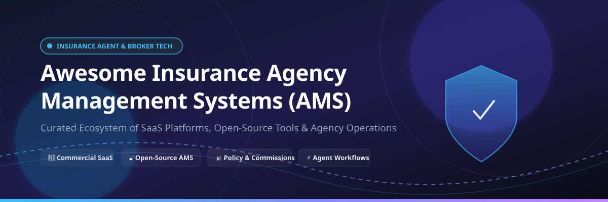

# 🏢 Awesome Insurance Agency Management System (AMS)

       

## 📌 Ecosystem Overview & Guide

A comprehensive, curated directory of **Commercial SaaS Platforms** and **Open-Source GitHub Projects** for **Insurance Agency Management Systems (AMS)**, **InsurTech CRMs**, policy administration, commission tracking, carrier rating, and producer productivity tools.

This repository serves independent insurance agencies, brokerages, MGAs (Managing General Agents), and InsurTech software engineers looking to discover, evaluate, and build agency technology solutions.

---

## 📑 Table of Contents

- [🏢 SaaS & Hosted Commercial Platforms](#-saas--hosted-commercial-platforms)
- [🔓 Open-Source GitHub Repositories](#-open-source-github-repositories)
- [🛠️ Frameworks & Hybrid Architecture Notes](#%EF%B8%8F-frameworks--hybrid-architecture-notes)
- [🤝 How to Contribute](#-how-to-contribute)
- [⚠️ Disclaimer](#%EF%B8%8F-disclaimer)
- [📈 Star History](#-star-history)
- [💖 Support & Contributing](#-support--contributing)

---

## 🏢 SaaS & Hosted Commercial Platforms

> 📊 **Sector Market Insights:** The global **Insurance Agency Management System (AMS)** market is estimated at **$3.85 Billion in 2026** and is projected to reach **$6.42 Billion by 2032** (CAGR ~8.8%). The market is **moderately concentrated** at the enterprise top tier—dominated by legacy market leaders Applied Systems and Vertafore holding substantial combined market share—while remaining **highly fragmented** in the independent agent, MGA, and niche mid-market sectors with dozens of specialized cloud software providers.

Below is a detailed overview of top commercial SaaS AMS and InsurTech platforms, sorted by **Company Size / Valuation / Revenue (Descending)**:

| 🚀 Platform Name & Link | 📝 Description & Key Capabilities | 💼 Company Size / Valuation / Revenue | 💵 Starting Price | 🎁 Free Tier / Trial Limits |
| :--- | :--- | :--- | :--- | :--- |
| **[Applied Epic](https://www.appliedsystems.com/)** | Enterprise-grade agency management system used by larger independent agencies and brokerages for complex commercial and personal lines workflows. | **$5.0B+ Valuation / $1.2B ARR** *(Backed by Hellman & Friedman & CapitalG)* | `$125/user/month` | `No free trial (live custom demo available)` |
| **[AMS360 (Vertafore)](https://www.vertafore.com/)** | Leading cloud AMS platform for independent agencies to manage policy lifecycles, accounting, producer commissions, and carrier downloads. | **$5.35B Valuation** *(Acquired by Roper Tech)* / **$600M+ ARR** | `$99/user/month` | `No free trial (guided product demo available)` |
| **[Sagitta (Vertafore)](https://www.vertafore.com/)** | Enterprise agency management system designed for high-volume commercial lines brokerages and complex insurance structures. | **Part of Vertafore ($5.35B Parent Valuation)** | `$200/user/month` | `No free trial (enterprise demo on request)` |
| **[QQCatalyst (Vertafore)](https://www.vertafore.com/)** | Web-based, cloud insurance AMS for small-to-medium independent agencies seeking intuitive policy and client servicing tools. | **Part of Vertafore ($5.35B Parent Valuation)** | `$115/month` | `14-day free trial (cloud edition)` |
| **[Applied TAM](https://www.appliedsystems.com/)** | Classic agency management system used across independent insurance agencies for policy and client administration. | **Part of Applied Systems ($5.0B+ Parent Valuation)** | `$110/user/month` | `No free trial (legacy demo system)` |
| **[EZLynx](https://www.ezlynx.com/)** | Comparative rating, customer management, and agency management platform for personal lines and independent agents. | **$415M Valuation** *(Acquired by Applied Systems)* / **~$70M ARR** | `$129/month` | `14-day free trial (starter rating module access)` |
| **[AgencyBloc](https://www.agencybloc.com/)** | AMS and CRM software built specifically for health, life, and benefits agencies as well as general line brokerages. | **~$100M Valuation** *(Backed by Lightyear Capital)* / **~$25M ARR** | `$59/month` | `14-day free trial (no credit card required)` |
| **[HawkSoft](https://www.hawksoft.com/)** | User-friendly agency management system for independent agents focused on workflows, policy tracking, and API integration. | **~$20M ARR** *(Private Independent, 150+ employees)* | `$250/month` | `No free trial (30-day money-back guarantee)` |
| **[Insly](https://www.insly.com/)** | Cloud insurance platform offering agency management, MGA underwriting tools, policy administration, and billing. | **~$15M Valuation** / **~$10M ARR** | `$49/user/month` | `30-day free trial (up to 5 team members)` |
| **[AgencyZoom](https://www.agencyzoom.com/)** | Sales automation and agency growth CRM platform integrated with commercial AMS systems for producer management. | **~$15M Valuation** *(Part of Vertafore Ecosystem)* | `$119/month` | `14-day free trial (full feature access)` |
| **[InsuredMine](https://www.insuredmine.com/)** | All-in-one insurance CRM and agency management platform focusing on sales pipeline, client portal, and analytics. | **~$100M Valuation / ~$8M ARR** | `$109/user/month` | `14-day free trial (all CRM/AMS features)` |
| **[NowCerts](https://www.nowcerts.com/)** | Cloud-based AMS providing automated policy management, certificate creation, billing, and carrier downloads. | **~$5M ARR** *(Bootstrapped / Independent)* | `$99/month` | `14-day free trial (1 user, full feature set)` |
| **[Jenesis](https://www.jenesis.com/)** | Web-based agency management software for independent insurance agents featuring rating and policy organization. | **~$4M ARR** *(Private Regional Vendor)* | `$135/month` | `30-day money-back trial period` |
| **[BindHQ / AgentCubed / InsuredHQ](https://www.bindhq.com/)** | Modern agency management and digital MGA platforms tailored for commercial brokers, MGAs, and life/health agents. | **~$3M–$10M Valuation** | `$89/month` | `14-day free trial (up to 3 users)` |

---

## 🔓 Open-Source GitHub Repositories

Full-featured commercial AMS applications rely heavily on proprietary carrier data standards (ACORD) and download pipelines. However, open-source projects, customized open-source CRMs, and ERP modules offer powerful foundations for agency automation, custom portals, and policy tracking.

Below is the list of open-source repositories sorted by **GitHub Stars (Descending)**:

| 🌟 Star Rating & Link | 📦 Repository & Project Name | 📋 Description & Use Case for Insurance Agencies |
| :--- | :--- | :--- |
|  | **[twentyhq/twenty](https://github.com/twentyhq/twenty)** | Modern open-source CRM alternative to Salesforce, adapted for insurance agency pipelines, client profiles, and policy tracking workflows. |
|  | **[odoo/odoo](https://github.com/odoo/odoo)** | Open-source ERP/CRM suite with specialized community & enterprise modules for insurance agencies, client management, policy records, and invoicing. |
|  | **[frappe/erpnext](https://github.com/frappe/erpnext)** | Full-featured open-source ERP system with customizable insurance broker apps, policy tracking, commissions, and customer accounting. |
|  | **[salesagility/SuiteCRM](https://github.com/salesagility/SuiteCRM)** | Enterprise open-source CRM platform configured by insurance agencies for lead management, policy renewal workflows, and client portals. |
|  | **[espocrm/espocrm](https://github.com/espocrm/espocrm)** | Lightweight web CRM application customized for policy records, claims tracking, carrier contact lists, and insurance producer pipelines. |
|  | **[sumitkumar1503/insurancemanagement](https://github.com/sumitkumar1503/insurancemanagement)** | Python & Django-based insurance management system handling customer policy records, premium payment tracking, and policy status. |
|  | **[prolinkinfo/InsuranceProCRM](https://github.com/prolinkinfo/InsuranceProCRM)** | MERN stack CRM designed for insurance agents and agencies to organize client details, policy renewals, and sales pipelines. |
|  | **[daxaxelrod/open_insure](https://github.com/daxaxelrod/open_insure)** | Open-source insurance policy management software written in Python for policy administration and client tracking. |
|  | **[flashvenom/quickfire](https://github.com/flashvenom/quickfire)** | Open-source core framework for Quickfire AMS, focusing on P&C broker workflows, policy administration, and carrier data structures. |
|  | **[techmistry/tmins](https://github.com/techmistry/tmins)** | Open-source insurance agency management system prototype built for small independent agencies and brokerage operations. |

---

## 🛠️ Frameworks & Hybrid Architecture Notes

- **CRM + Custom DB Pattern**: Track clients and policies in an open CRM (e.g., Twenty, ERPNext) while using custom scripts for policy renewal notifications.
- **Document Repositories**: Store policy documents, endorsements, and certificates of insurance in self-hosted, secure object storage.
- **Carrier & Rating Integrations**: Most commercial comparative rating tools require direct carrier APIs. Hybrid architectures combine open client portals with commercial rating backends.

---

## 🤝 How to Contribute

1. Fork this repository.
2. Add or update entries in `README.md` keeping descriptions objective and verified.
3. Check the [Awesome List Guidelines](https://github.com/ishandutta2007/Awesome-Awesome-Awesome) for contribution best practices.
4. Submit a Pull Request with a clear description of changes.

---

## ⚠️ Disclaimer

- This is a **community-curated directory** provided for research purposes.
- Insurance agency management systems handle sensitive personally identifiable information (PII) and policy records subject to insurance privacy regulations. Ensure compliance, encryption, and audit capabilities before deploying any solution.

---

## 📈 Star History

---

## 💖 Support & Contributing

Thank you for exploring the **Awesome Insurance Agency Management System (AMS)** ecosystem repository!

Whether you are an independent insurance agent, agency principal, broker, or InsurTech developer, your contributions and feedback help keep this list accurate and comprehensive.

### 🌟 How to Support:
- ⭐️ **Star this repository** on GitHub if you found it useful!
- 🔀 **Fork & Contribute** by submitting a Pull Request with new SaaS tools or open-source projects.
- 📢 **Share with fellow agents & developers** across social media, forums, and tech communities.
- ☕ **Buy me a coffee / Sponsor**: If this project saved you time or aided your research, support ongoing maintenance via the [GitHub Sponsor Dashboard](https://github.com/sponsors/ishandutta2007)!

  

